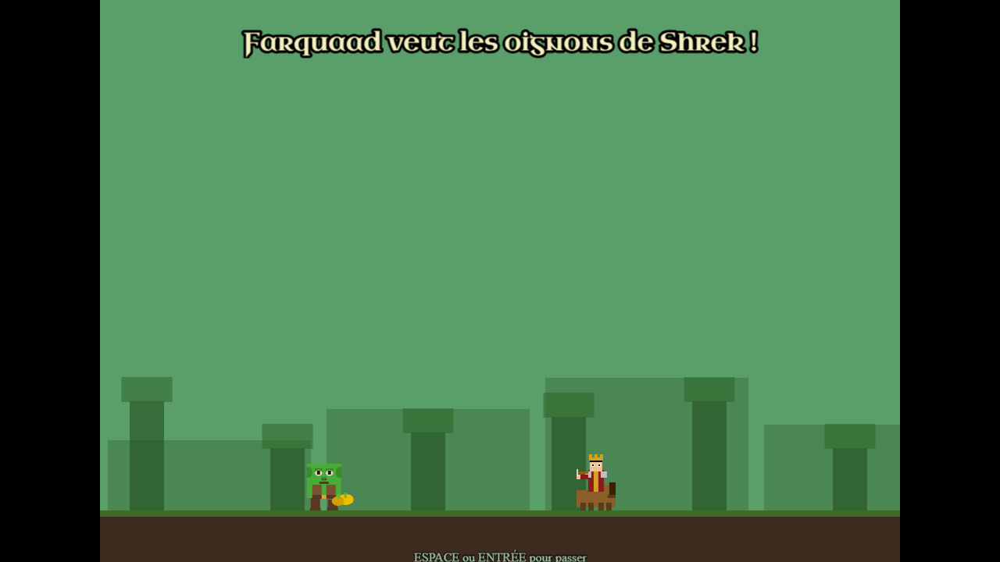
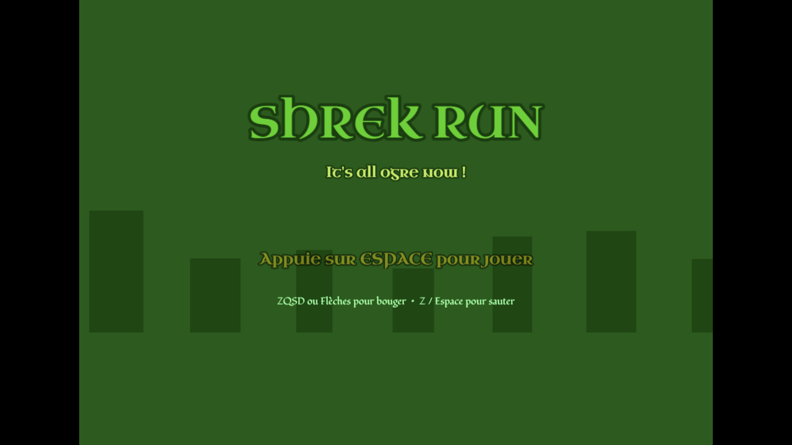

# 🧅 Shrek Run

> Runner / platformer 2D — Aidez Shrek à fuir Lord Farquaad !

| Menu principal | Gameplay |
|:---:|:---:|
|  |  |

## Synopsis

Dans ce jeu de type runner-platformer en side-scrolling, vous incarnez **Shrek** qui doit traverser tout le marais pour rejoindre sa cabane, poursuivi par **Lord Farquaad** à cheval. Ramassez des oignons en chemin, évitez les obstacles et ne vous faites pas rattraper !

Une cinématique d'introduction explique pourquoi Farquaad s'est mis en colère contre Shrek… 😏

## Stack technique

| Technologie | Version | Rôle |
|-------------|---------|------|
| [Phaser](https://phaser.io) | 4 | Moteur de jeu (arcade physics, scenes, tweens) |
| [React](https://react.dev) | 19 | Interface autour du jeu |
| [Vite](https://vitejs.dev) | 6 | Bundler / dev server |

> Tous les sprites sont générés **procéduralement** en JavaScript — aucun fichier image externe.

## Gameplay

### Objectif
Traverser le niveau de gauche à droite (6 400 px) jusqu'à la cabane de Shrek, sans être rattrapé par Farquaad.  
Ramassez au moins **7 oignons sur 21** pour débloquer l'arrivée.

### Contrôles
| Action | Touches |
|--------|---------|
| Se déplacer | `Q` / `D` ou `←` / `→` |
| Sauter | `Z`, `↑` ou `Espace` |
| Passer la cinématique | `Échap` |

### Obstacles & mécaniques
- 🐾 **Zones de boue** : ralentissent Shrek
- 👨‍🌾 **Villageois** : contact = game over
- 🐴 **Farquaad** : vous rattrape progressivement — contact = game over
- 🧅 **Oignons** : collectibles flottants, minimum 7 requis pour terminer le niveau
- 📈 **Difficulté croissante** : la vitesse augmente au fil du temps

### Décors notables
- 🌿 Arbres organiques façon marais
- 🐉 Dragon et Âne sur une plateforme (clin d'œil à Shrek 2 ❤️)

## Lancer le jeu

```bash
npm install
npm run dev
# → http://localhost:8080
```

```bash
npm run build   # Build de production dans dist/
```

## Structure du projet

```
src/
├── game/
│   ├── scenes/
│   │   ├── Intro.js        # Cinématique d'introduction
│   │   ├── MainMenu.js     # Menu principal
│   │   ├── Game.js         # Scène de jeu principale
│   │   ├── GameOver.js     # Écran de game over
│   │   └── ScoreSummary.js # Écran de fin avec note
│   ├── AudioManager.js     # Effets sonores
│   └── EventBus.js         # Communication React ↔ Phaser
└── App.jsx
```
